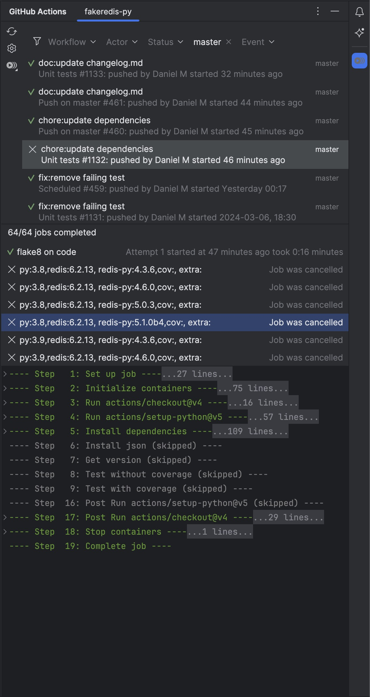
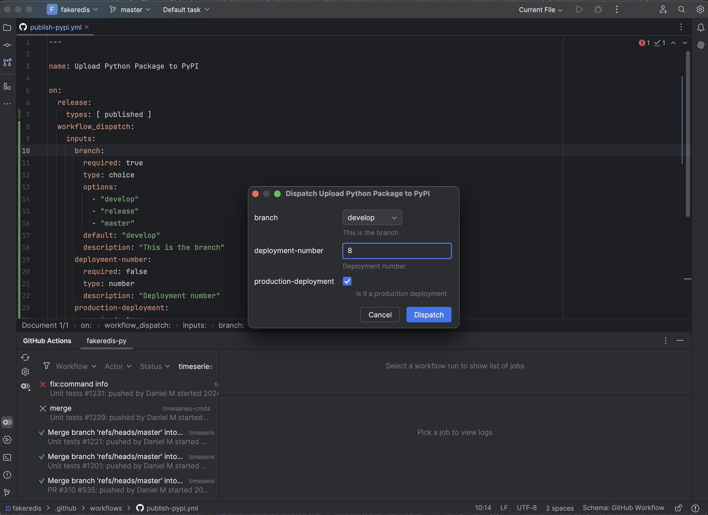
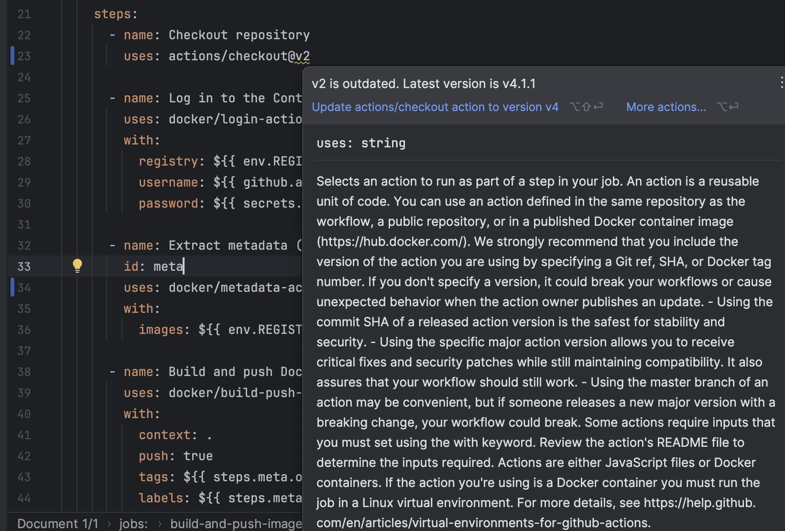
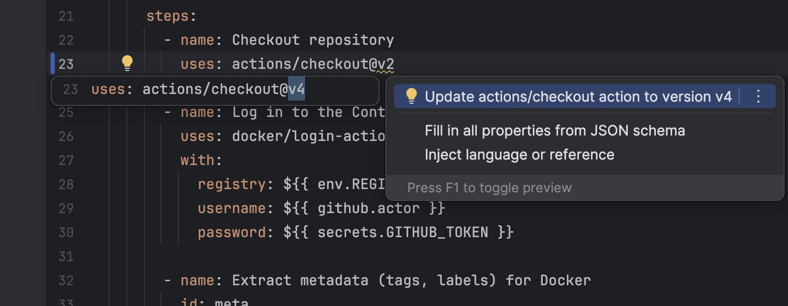
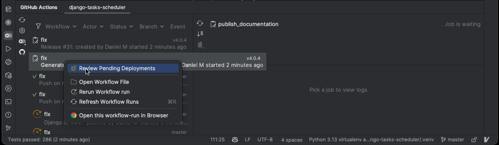
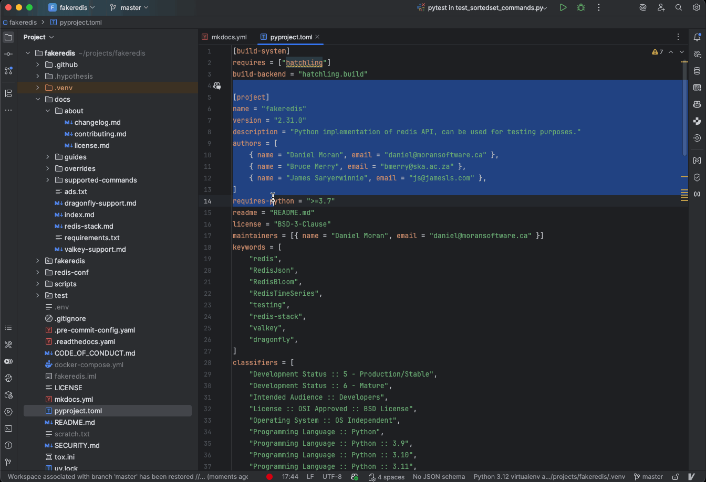

GitHub Actions Manager for JetBrains IDEs
=========================================

[![Version][version-badge]][marketplace]
[![Downloads][download-badge]][marketplace]

You can view a demo of most of the features explained in this video: [YouTube][youtube-video]

<!-- Plugin description -->
This plugin creates a tool-window on JetBrains products (IntelliJ, PyCharm, ...) where you can view GitHub Actions
workflow-runs of the repository. This plugin is a good alternative to alt-tabbing for every time you push some changes
to the branch and want to see whether the repository's checks are passing on your changes.

You can support the development of the plugin and additional advanced features by
[purchasing the plugin on the JetBrains marketplace][marketplace].

# Features

### Free Features (No license required)

- View the latest workflow-runs and their statuses.
    - Automatically refreshes every 30 seconds (configurable).
    - Can filter by: workflow-type, user who initiated, branch and event.
    - Can filter by the current-branch, i.e., update workflow-runs when branch changes, and current user.
- View jobs of a workflow-run and their statuses.
- View logs of a job, separated by each step result.
- Configuring settings
    - Use a customized token instead of GitHub settings
    - Frequency of auto-refresh.
    - Customize repositories that should be presented/hidden.

### Paid Features (License required)

- View and download the workflow-run's artifacts.
- Open pull-request that triggered a workflow-run (in IDE/browser).
- Approve deployments for workflow-runs that require approval.
- Trigger a workflow-run for workflows that can be manually dispatched.
    - Ability to provide inputs for workflow ([All GitHub supported input types supported][workflow-inputs]).
- Rerun/Cancel a workflow-run or a specific job in a workflow-run.
- Open the workflow file of the workflow-run.
- Create a link of selected file lines in GitHub

### Editing workflow files

- Highlight outdated actions as warnings
    - Quickfix: update them to the latest version.
- Highlight unknown actions
- Navigate to action repository for remote actions
- Navigate to action file for local actions

<!-- Plugin description end -->

# Installation

Using IDE built-in plugin system:

<kbd>Settings/Preferences</kbd> >
<kbd>Plugins</kbd> >
<kbd>Marketplace</kbd> >
<kbd>Search for "GitHub Actions Manager"</kbd> >
<kbd>Install Plugin</kbd>

# Screenshots

### View workflow-runs/jobs/logs

 

### Dispatch a workflow that has inputs

### See outdated action in workflow files

### Quickfix to update the action version in workflow files

### Approve deployment

### Create a link of selected file lines in GitHub

[version-badge]:https://img.shields.io/jetbrains/plugin/v/com.dsoftware.ghtoolbar.svg

[download-badge]:https://img.shields.io/jetbrains/plugin/d/com.dsoftware.ghtoolbar.svg

[youtube-video]:https://youtu.be/nFrs8W2gSC8

[gh-docs-workflow-inputs]:https://docs.github.com/en/enterprise-cloud@latest/actions/using-workflows/workflow-syntax-for-github-actions#onworkflow_dispatchinputs

[marketplace]: https://plugins.jetbrains.com/plugin/19347-github-actions-manager

[workflow-inputs]:https://docs.github.com/en/enterprise-cloud@latest/actions/using-workflows/workflow-syntax-for-github-actions#onworkflow_dispatchinputs