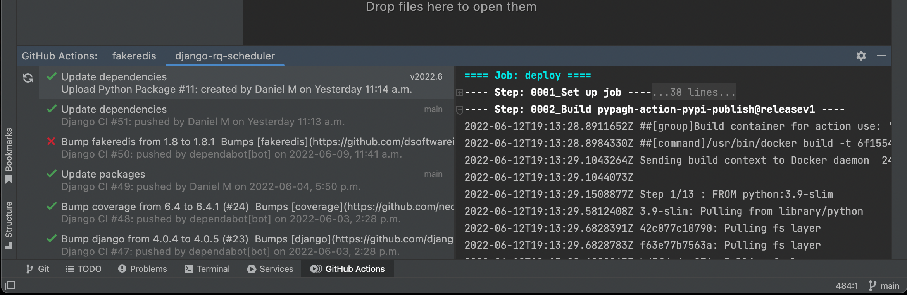
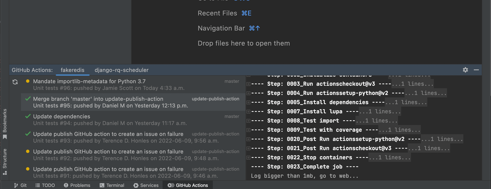

GitHub Actions Toolbar for JetBrains IDEs
=========================================

# Screenshots

<!-- Plugin description -->
This plugin creates a toolbar on JetBrains products (IntelliJ, PyCharm, ...) 
where you can view GitHub workflow runs of the repository.
This plugin is a good alternative to alt-tabbing for every time you push 
some changes to the branch and want to see whether the repository's checks 
are passing on your changes.

# Contributions
Contributions are welcome. Please see the
[contributing guide](https://github.com/cunla/ghactions-toolbar//blob/master/.github/CONTRIBUTING.md) for more details.
The maintainer generally has very little time to work on ghactions-toolbar, so the
best way to get a bug fixed is to contribute a pull request.

If you'd like to help out, you can start with any of the issues
labeled with `Help wanted`.

# Sponsor
github-actions-toolbar for JetBrains products is developed for free.

Support this project by becoming a sponsor using [this link](https://github.com/sponsors/cunla).

Alternatively, you can buy me coffee using this link: 

# Installation

- Using IDE built-in plugin system:

  <kbd>Settings/Preferences</kbd> >
  <kbd>Plugins</kbd> >
  <kbd>Marketplace</kbd> >
  <kbd>Search for "github actions toolbar"</kbd> >
  <kbd>Install Plugin</kbd>

- Manually:

  Download the [latest release](https://github.com/cunla/ghactions-toolbar/releases/latest) and install it manually using
  <kbd>Settings/Preferences</kbd> > <kbd>Plugins</kbd> > <kbd>⚙️</kbd> > <kbd>Install plugin from disk...</kbd>

<!-- Plugin description end -->

Based on [Otanikotani's github-actions-tab](https://github.com/Otanikotani/view-github-actions-idea-plugin).
