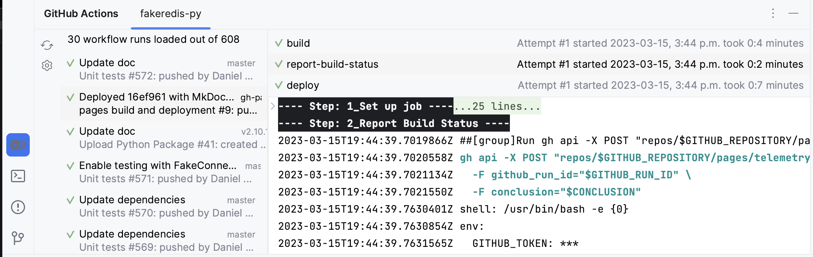
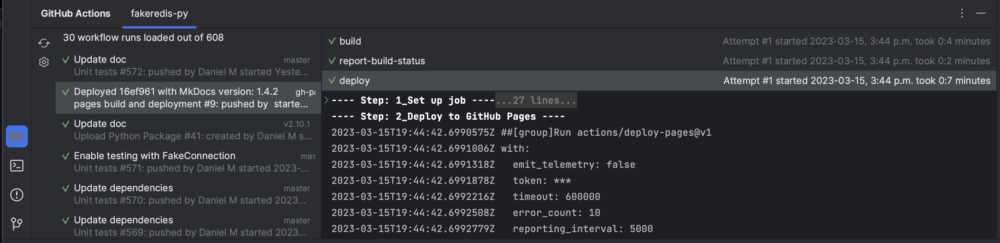
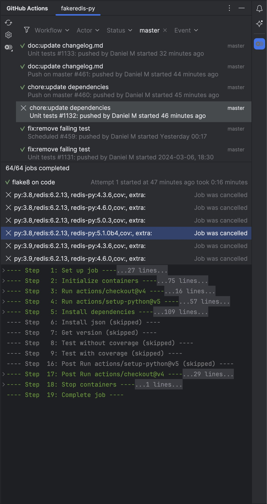
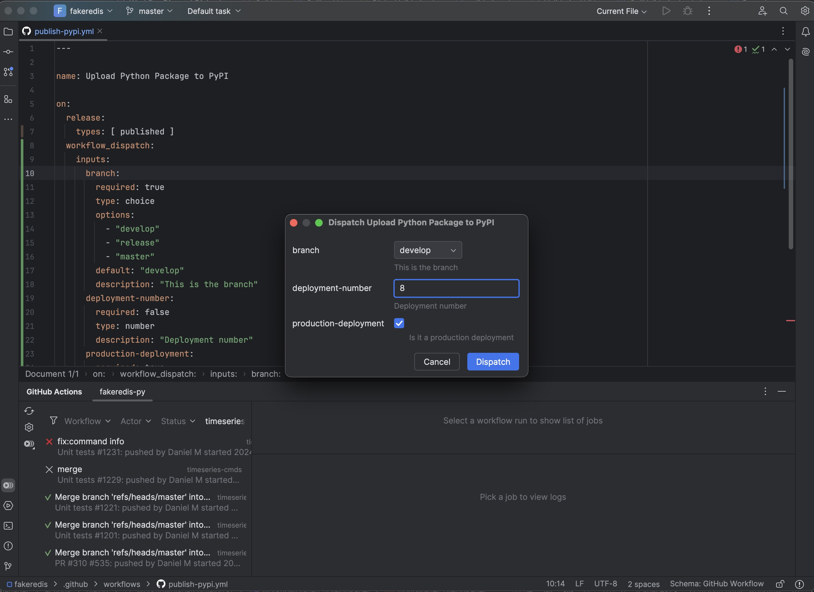
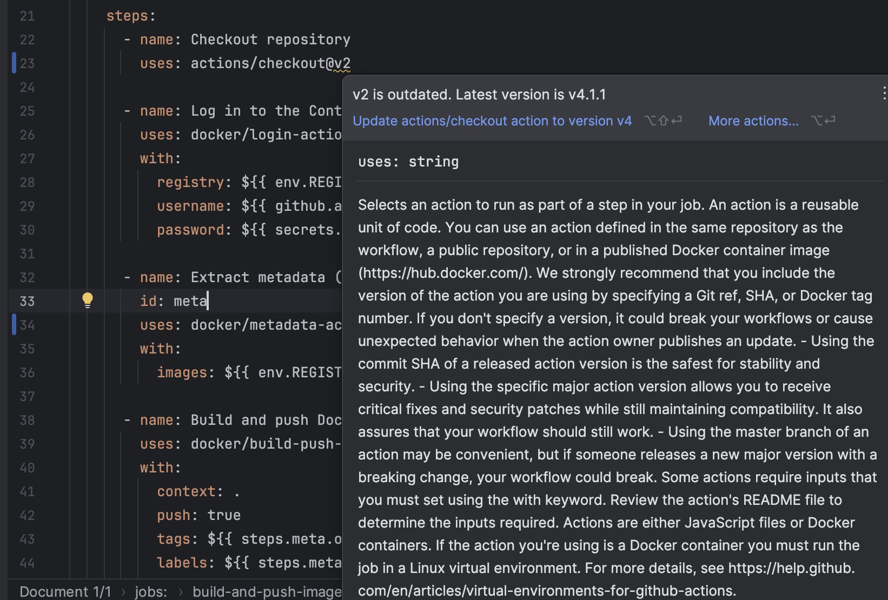
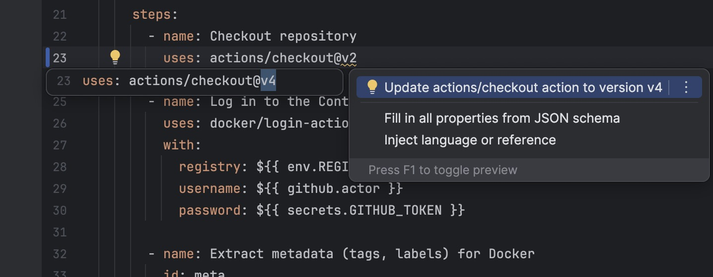
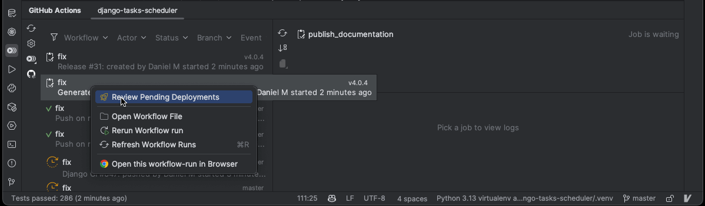
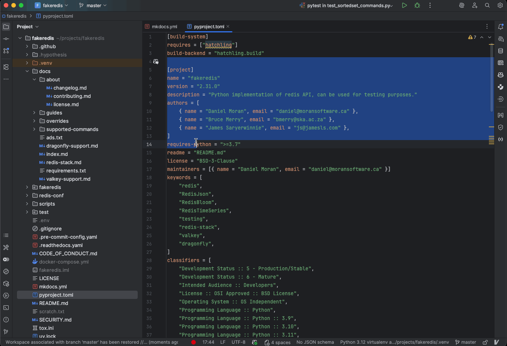

GitHub Actions Manager for JetBrains IDEs
=========================================

[![Version][version-badge]][marketplace]
[![Downloads][download-badge]][marketplace]
[![Rating][rating-badge]][marketplace]

Manage GitHub Actions without leaving your JetBrains IDE - watch workflow runs, read step-by-step logs, dispatch
workflows, approve deployments, and keep your workflow files up to date.

📺 Watch a demo of most features in this [YouTube walkthrough][youtube-video].

## Table of Contents

- [Features](#features)
    - [Free features](#free-features-no-license-required)
    - [Paid features](#paid-features-license-required)
    - [Repository settings](#repository-settings-license-required)
    - [Workflow file editing](#workflow-file-editing)
- [Requirements](#requirements)
- [Installation](#installation)
- [Getting started](#getting-started)
- [Screenshots](#screenshots)
- [Support & contributing](#support--contributing)

# Features

<!-- Plugin description -->
This plugin brings GitHub Actions to JetBrains IDEs, so you don't have to jump back and forth between the IDE and the
browser. It works with GitHub.com and GitHub Enterprise Server, and supports workflow dispatch, deployment approval, and
other common GitHub Actions use-cases.

You can support the development of the plugin and unlock additional advanced features by
[purchasing a license on the JetBrains Marketplace](https://plugins.jetbrains.com/plugin/19347-github-actions-manager).
You can
fill [this form](https://docs.google.com/forms/d/e/1FAIpQLSe7Nmpz8UcjQh493pwMnuKCdM17uOqIdCOhwEjWUc77wzwrHg/viewform?usp=header)
to receive a discount code.

### Free features (no license required)

- **View workflow runs, jobs, and logs**
    - See real-time and historical workflow runs directly in the IDE.
    - Jobs are shown as a tree, grouping matrix and reusable-workflow jobs under their parent for easy scanning.
    - Logs are organized step-by-step for easier debugging.
    - Track live runs as they progress or review past runs at a glance.
    - Filter runs by branch, actor, event, or status - individually or in combination. Includes a current-branch filter
      that updates automatically when you switch branches.
    - New runs appear automatically (refreshes every 30s by default; configurable).
- **Settings & configuration**
    - Use a custom token instead of GitHub's default authentication.
    - Control the auto-refresh frequency.
    - Choose which repositories to show or hide.
    - Assign a GitHub account per repository, and switch assignments anytime via plugin settings.

### Paid features (license required)

- View and download workflow run artifacts.
- Open the pull request that triggered a run (in the IDE or browser).
- Approve workflow-run deployments that require approval.
- Manually trigger dispatchable workflows, with full input support
  ([all GitHub input types](https://docs.github.com/en/actions/using-workflows/workflow-syntax-for-github-actions#onworkflow_dispatchinputs)).
- Rerun or cancel a workflow run - or even just a single job.
- Open the workflow file associated with a run.
- Generate GitHub links to specific file lines from the IDE.

### Repository settings (license required)

Manage a repository's GitHub Actions configuration from a dedicated settings dialog, without opening the browser:

- **Variables & secrets** - list, add, edit, and delete repository and organization variables; list and delete
  secrets. Organization-level items are shown when the repository belongs to an organization, and you can choose a
  new organization variable's visibility (all repositories, or private/internal only). (Creating or editing secret
  values from the IDE is not supported yet.)
- **Collaborators** - view the repository's collaborators and add or remove them.
- **Environments** - create and delete deployment environments. For each environment:
    - Edit environment variables (add, update, delete).
    - Review environment secrets and deployment protection rules.
    - Manage which branches and tags are allowed to deploy: review the deployment branch policy and add or remove
      branch/tag name patterns.

### Workflow file editing

- Highlight outdated GitHub Actions as warnings, with a quick-fix to update to the latest version.
- Flag unknown actions.
- Navigate directly to an action's repository (for remote actions).
- Jump to the action file (for local actions).

<!-- Plugin description end -->

# Requirements

- A JetBrains IDE, build **2025.3** or later (IntelliJ IDEA, PyCharm, WebStorm, GoLand, etc.).
- A GitHub account configured in <kbd>Settings/Preferences</kbd> > <kbd>Version Control</kbd> > <kbd>GitHub</kbd>, or a
  custom token set in the plugin settings.

# Installation

Using the IDE built-in plugin system:

<kbd>Settings/Preferences</kbd> >
<kbd>Plugins</kbd> >
<kbd>Marketplace</kbd> >
<kbd>Search for "GitHub Actions Manager"</kbd> >
<kbd>Install Plugin</kbd>

Or install it directly from the [JetBrains Marketplace][marketplace].

# Getting started

1. Open a project that is hosted on GitHub (the plugin detects the repository from your git remotes).
2. Make sure a GitHub account is configured, or set a custom token in
   <kbd>Settings/Preferences</kbd> > <kbd>Tools</kbd> > <kbd>GitHub Actions Manager</kbd>.
3. Open the **GitHub Actions** tool window to browse workflow runs, jobs, and logs.
4. Use the filters at the top of the runs list to narrow down by branch, actor, event, or status.

# Screenshots

### View workflow-runs/jobs/logs

 

### Dispatch a workflow that has inputs

### See outdated action in workflow files

### Quickfix to update the action version in workflow files

### Approve deployment

### Create a link of selected file lines in GitHub

# Support & contributing

- 🐛 Found a bug or have a feature request? [Open an issue][issues].
- 🔒 Security concern? See [SECURITY.md](SECURITY.md).
- 📋 See [CHANGELOG.md](CHANGELOG.md) for release history.

[version-badge]:https://img.shields.io/jetbrains/plugin/v/com.dsoftware.ghtoolbar.svg

[download-badge]:https://img.shields.io/jetbrains/plugin/d/com.dsoftware.ghtoolbar.svg

[rating-badge]:https://img.shields.io/jetbrains/plugin/r/rating/com.dsoftware.ghtoolbar.svg

[youtube-video]:https://youtu.be/nFrs8W2gSC8

[marketplace]: https://plugins.jetbrains.com/plugin/19347-github-actions-manager

[issues]: https://github.com/dsoftwareinc/ghactions-manager/issues
