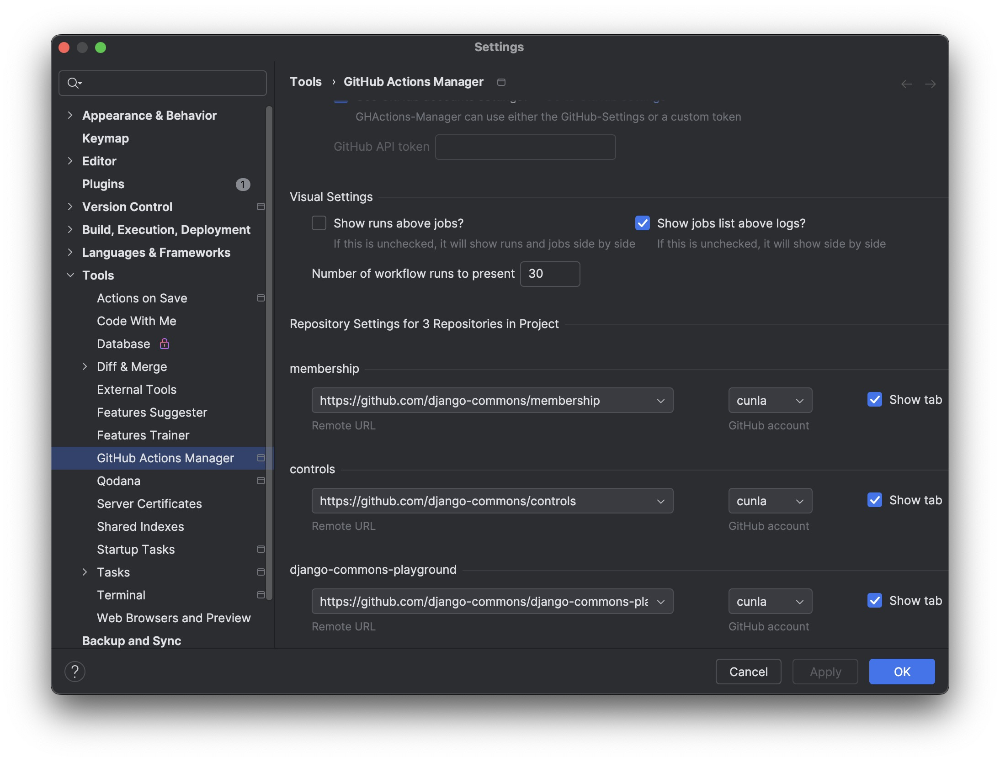
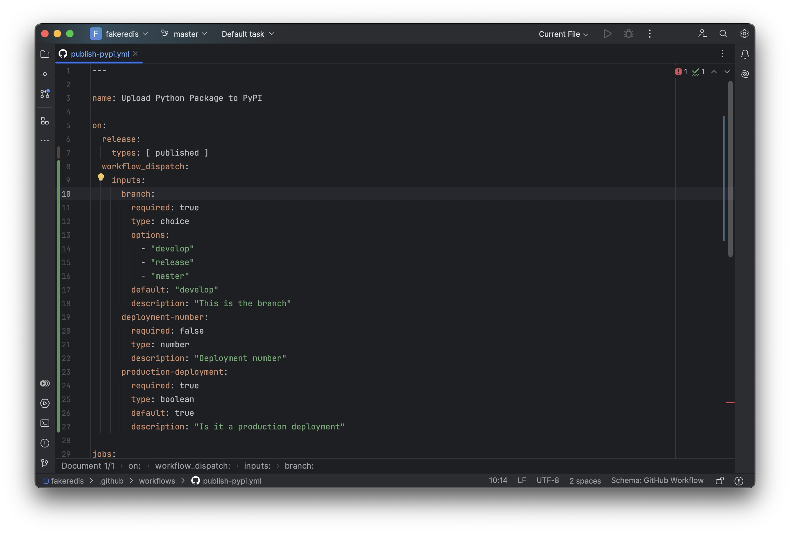
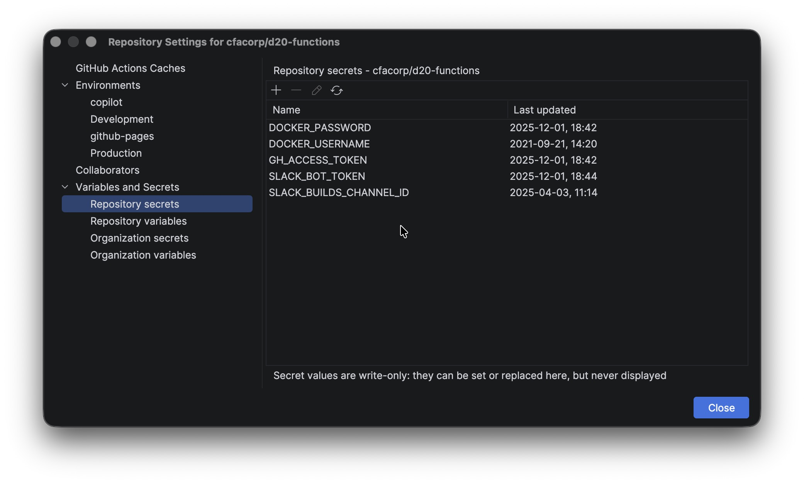
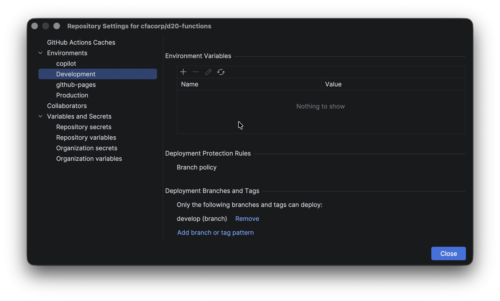
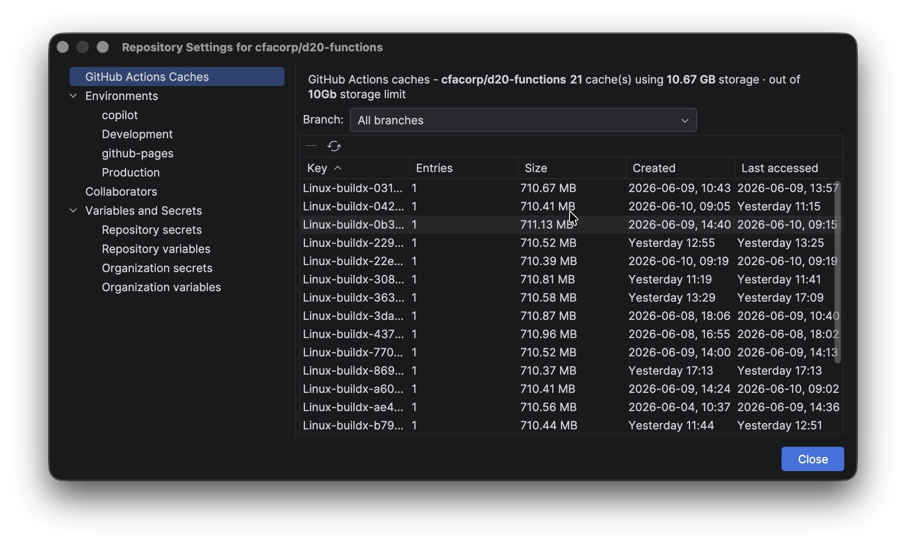

GitHub Actions Manager for JetBrains IDEs
=========================================

[![Version][version-badge]][marketplace]
[![Downloads][download-badge]][marketplace]
[![Rating][rating-badge]][marketplace]

Manage GitHub Actions without leaving your JetBrains IDE – watch workflow runs, read step-by-step logs, dispatch
workflows, approve deployments, and keep your workflow files up to date.

📺 Watch a demo of most features in this [YouTube walkthrough][youtube-video].

## Table of Contents

- [Features](#features)
    - [Free features](#free-features-no-license-required)
    - [Paid features](#paid-features-license-required)
    - [Repository settings](#repository-settings-license-required)
    - [Workflow file editing](#workflow-file-editing)
- [Requirements](#requirements)
- [Installation](#installation)
- [Getting started](#getting-started)
- [Screenshots](#screenshots)
- [Support & contributing](#support--contributing)

# Features

<!-- Plugin description -->
**The missing GitHub Actions UI for JetBrains IDEs.** GitHub ships an official Actions extension for VS Code — JetBrains
users get this plugin instead: watch workflow runs live, read step-by-step logs, dispatch workflows, approve
deployments, and manage Actions secrets and variables, all without leaving the IDE.

It works with GitHub.com **and GitHub Enterprise Server** — if your GHES instance lives behind a VPN, this is the
fastest way to follow a run or approve a deployment.

**Why an IDE plugin instead of the browser or `gh` CLI?**

- No tab-juggling: the run triggered by your push is one tool window away, filtered to your current branch.
- Logs are split per step and rendered in the IDE, instead of one giant scrolling page.
- A failed run is fixable on the spot — jump to the workflow file, fix, push, watch the rerun.

Viewing runs, jobs, and logs is **free, forever**. Advanced features (dispatch, rerun/cancel, deployment approval,
artifacts, repository settings) come with a license —
[start a free 30-day trial on the JetBrains Marketplace](https://plugins.jetbrains.com/plugin/19347-github-actions-manager),
or
fill [this form](https://docs.google.com/forms/d/e/1FAIpQLSe7Nmpz8UcjQh493pwMnuKCdM17uOqIdCOhwEjWUc77wzwrHg/viewform?usp=header)
to receive a discount code.

### Free features (no license required)

- **View workflow runs, jobs, and logs**
    - See real-time and historical workflow runs directly in the IDE.
    - Jobs are shown as a tree, grouping matrix and reusable-workflow jobs under their parent for easy scanning.
    - Logs are organized step-by-step for easier debugging.
    - Search within a job's log using the IDE's find bar (<kbd>⌘F</kbd> / <kbd>Ctrl+F</kbd>) – logs render in a
      standard editor console.
    - Track live runs as they progress or review past runs at a glance.
    - Filter runs by branch, actor, event, or status – individually or in combination. Includes a current-branch filter
      that updates automatically when you switch branches.
    - New runs appear automatically (refreshes every 30s by default; configurable).
- **Settings & configuration**
    - Use a custom token instead of GitHub's default authentication.
    - Control the auto-refresh frequency.
    - Choose which repositories to show or hide.
    - Assign a GitHub account per repository and switch assignments anytime via plugin settings.

### Paid features (license required)

- View and download workflow run artifacts.
- Open the pull request that triggered a run (in the IDE or browser).
- Approve workflow-run deployments that require approval.
- Manually trigger dispatchable workflows, with full input support
  ([all GitHub input types](https://docs.github.com/en/actions/using-workflows/workflow-syntax-for-github-actions#onworkflow_dispatchinputs)).
- Rerun or cancel a workflow run – or even just a single job.
- View a job's annotations (failures, warnings, and notices) in a banner above the step log, and click an annotation to
  jump straight to the offending file and line in the editor.
- Open the workflow file associated with a run.
- Generate GitHub links to specific file lines from the IDE.

### Repository settings (license required)

Manage a repository's GitHub Actions configuration from a dedicated settings dialog without opening the browser:

- **Variables & secrets** – list, add, edit, and delete repository and organization variables and secrets. Secret values
  are encrypted locally with the repository/organization public key (libsodium sealed box) before upload, and are
  write-only: they can be replaced but never read back. Organization-level items are shown when the repository belongs
  to an organization, and you can choose a new organization variable's or secret's visibility (all repositories, or
  private/internal only).
- **Collaborators** – view the repository's collaborators and add or remove them.
- **Actions caches** – browse the repository's GitHub Actions caches (with per-branch filtering, sizes, and total
  storage usage) and delete stale entries.
- **Environments** – create and delete deployment environments. For each environment:
    - Edit environment variables (add, update, delete).
    - Review environment secrets and deployment protection rules.
    - Manage which branches and tags are allowed to deploy: review the deployment branch policy and add or remove
      branch/tag name patterns.

### Workflow file editing

- Highlight outdated GitHub Actions as warnings with a quick-fix to update to the latest version.
- Flag unknown actions.
- Navigate directly to an action's repository (for remote actions).
- Jump to the action file (for local actions).

<!-- Plugin description end -->

# Requirements

- A JetBrains IDE, build **2025.3** or later (IntelliJ IDEA, PyCharm, WebStorm, GoLand, etc.).
- A GitHub account configured in <kbd>Settings/Preferences</kbd> > <kbd>Version Control</kbd> > <kbd>GitHub</kbd>, or a
  custom token set in the plugin settings.

# Installation

Using the IDE built-in plugin system:

<kbd>Settings/Preferences</kbd> >
<kbd>Plugins</kbd> >
<kbd>Marketplace</kbd> >
<kbd>Search for "GitHub Actions Manager"</kbd> >
<kbd>Install Plugin</kbd>

Or install it directly from the [JetBrains Marketplace][marketplace].

# Getting started

1. Open a project hosted on GitHub (the plugin detects the repository from your git remotes).
2. Make sure a GitHub account is configured or set a custom token in
   <kbd>Settings/Preferences</kbd> > <kbd>Tools</kbd> > <kbd>GitHub Actions Manager</kbd>.
3. Open the **GitHub Actions** tool window to browse workflow runs, jobs, and logs.
4. Use the filters at the top of the runs list to narrow down by branch, actor, event, or status.

# Screenshots

### Workflow runs, jobs, and step-by-step logs

<table>
  <tr>
    <td width="50%"></td>
    <td width="50%"></td>
  </tr>
</table>

The tool window also works as a sidebar — runs, jobs, and logs stacked vertically:

### Plugin settings

Use a custom token, tune the tool-window layout, and assign a GitHub account (or hide the tab) per repository:

### Dispatch a workflow with inputs

All `workflow_dispatch` input types are supported — choice, boolean, number, string:

<table>
  <tr>
    <td width="50%"></td>
    <td width="50%"></td>
  </tr>
</table>

### Approve deployments

### Repository settings

Manage Actions secrets, variables, environments, and caches without opening the browser:

<table>
  <tr>
    <td width="50%"></td>
    <td width="50%"></td>
  </tr>
</table>

### Workflow file editing

Outdated actions are highlighted, with a quick-fix to bump the version:

<table>
  <tr>
    <td width="50%"></td>
    <td width="50%"></td>
  </tr>
</table>

### Link to file lines on GitHub

# Support & contributing

- 🐛 Found a bug or have a feature request? [Open an issue][issues].
- 🔒 Security concern? See [SECURITY.md](SECURITY.md).
- 📋 See [CHANGELOG.md](CHANGELOG.md) for release history.

[version-badge]:https://img.shields.io/jetbrains/plugin/v/com.dsoftware.ghtoolbar.svg

[download-badge]:https://img.shields.io/jetbrains/plugin/d/com.dsoftware.ghtoolbar.svg

[rating-badge]:https://img.shields.io/jetbrains/plugin/r/rating/com.dsoftware.ghtoolbar.svg

[youtube-video]:https://youtu.be/nFrs8W2gSC8

[marketplace]: https://plugins.jetbrains.com/plugin/19347-github-actions-manager

[issues]: https://github.com/dsoftwareinc/ghactions-manager/issues
